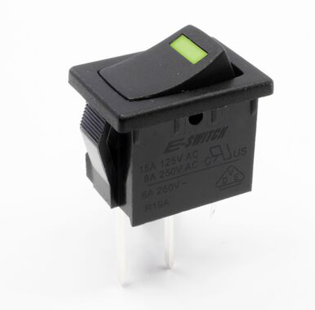
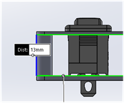
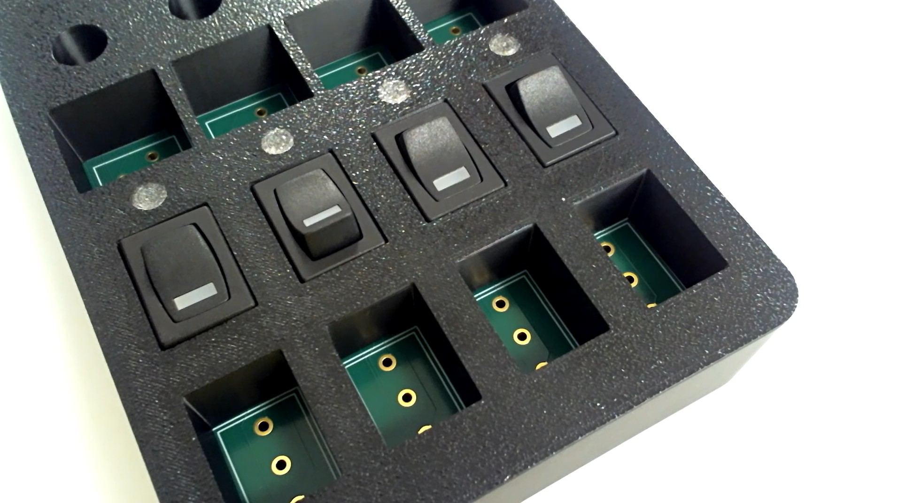
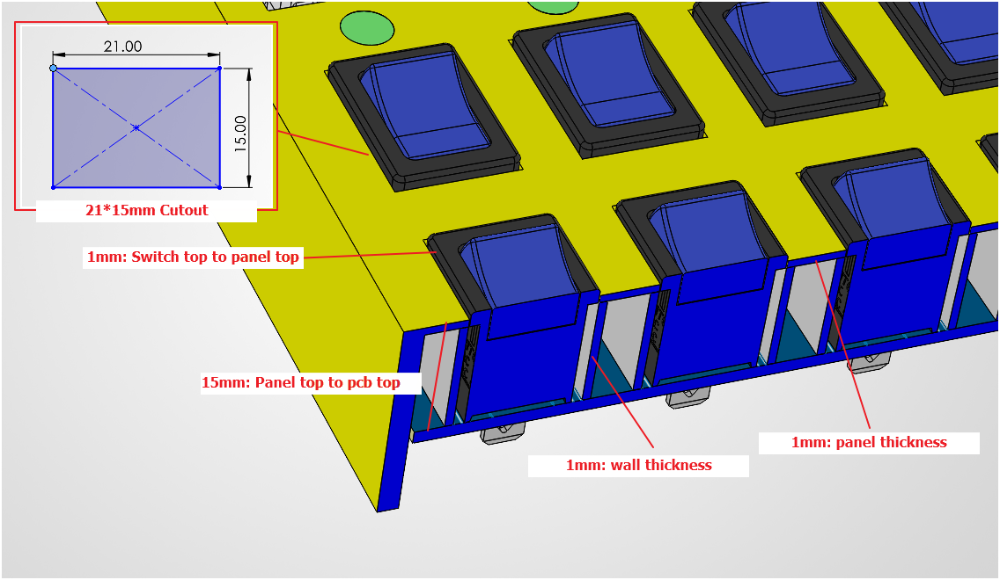

# R1966 Switches

- 'P' Terminal is for PCB soldering
### 'P' Terminal
Part Number
- R1966A = SPST, ON-OFF
- R1966D = SPDT, ON-OFF-ON

## 1. Mechanical Design

### (1) Panel Mounting: 19.2x13.0x1mm thick panel is very tight.

### (2) PCB Mounting: skip using the panel clips

Tested on 'HIL-TEST1'

## 2. Electronical Design

## 3. Testing Printing

