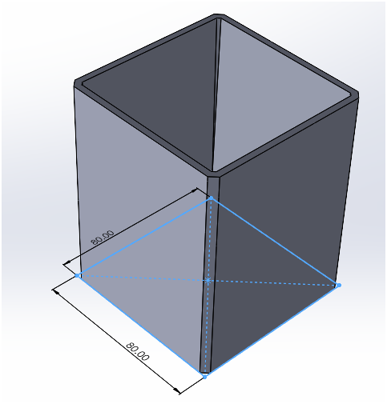
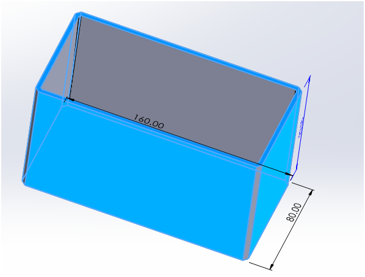

# TOOL HOLDER

A simple design for tool holders 

2025/11/18 v1
2025/11/26 v2 add long version

# V1 design

- 8cm x 8cm bottom, height is 100mm,
- walls and bottom are 3mm thick.
- Chamfer 3mm,45deg on 4 edges.
Drafted 1.5 deg inward:

# V2 Design
- 8cm x 16cm x 9cm high, also cut 1.5deg draft inward.
- Chamfer 3mm,45deg on 4 edges.

# END