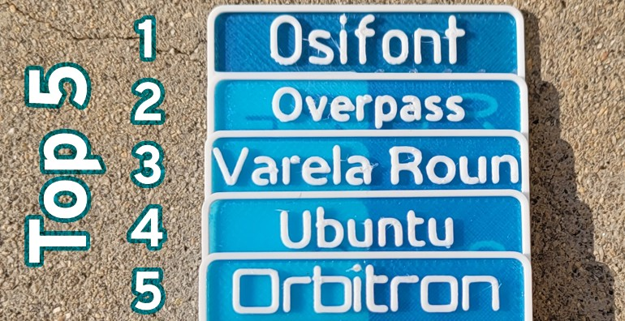

# Fonts that are suitable for 3d printing

- Take-away: with 0.4mm nozzel, a 3d printer can not print too good letters, bacause the printer header can not move along a very sharp angle.
- Take-away2: lower your expectation, its quality is far away from the regular 2d paper printer
- When font size is bigger than 5mm, it's ok to 3d printing.

## Good and Free Fonts

(by Teque5 [(link)](https://forum.prusa3d.com/forum/english-forum-general-discussion-announcements-and-releases/study-best-small-font-for-3d-printing/))

## How to install the font

For windows, unzip the file in the directory (same with this markdown). Double click the .tff file and press 'install'. Do the same for both .tff files to install all font variations. 

